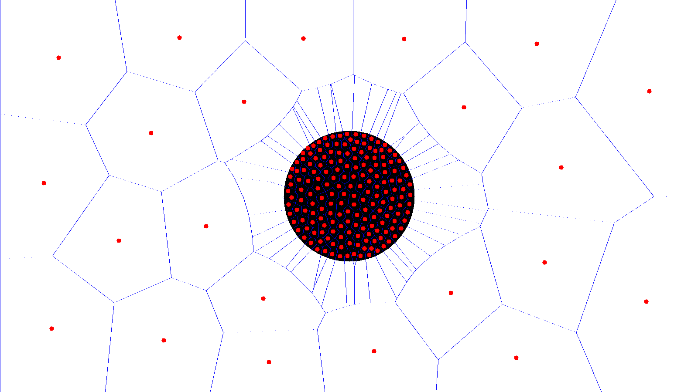
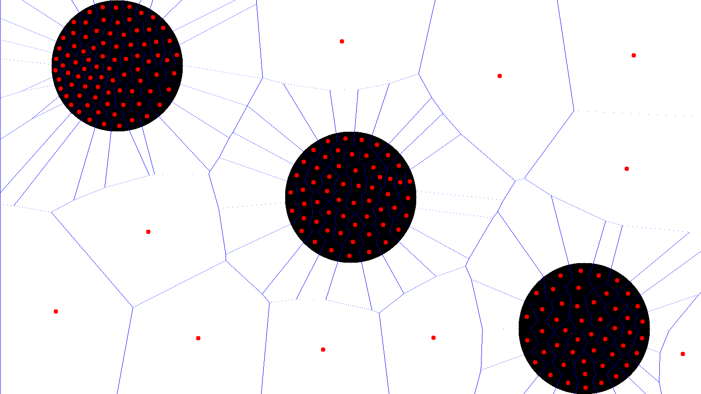

# Stippling using weighted voronoi

## Quickstart

- Build the executable and run.
    ```console
    $ make
    $ ./main
    ```

## Examples

- Black circle at the center:


- Black circle at the center, with the initial uniform distribution as a square enclosing the circle: (200 pts)


- Three black circles: (200 pts)

